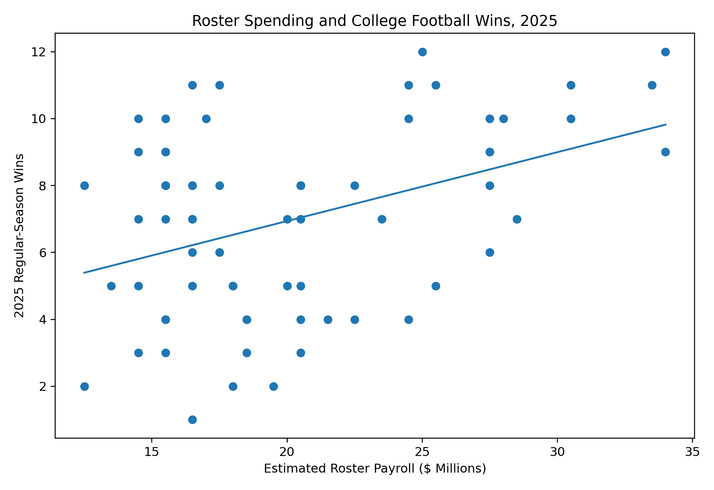
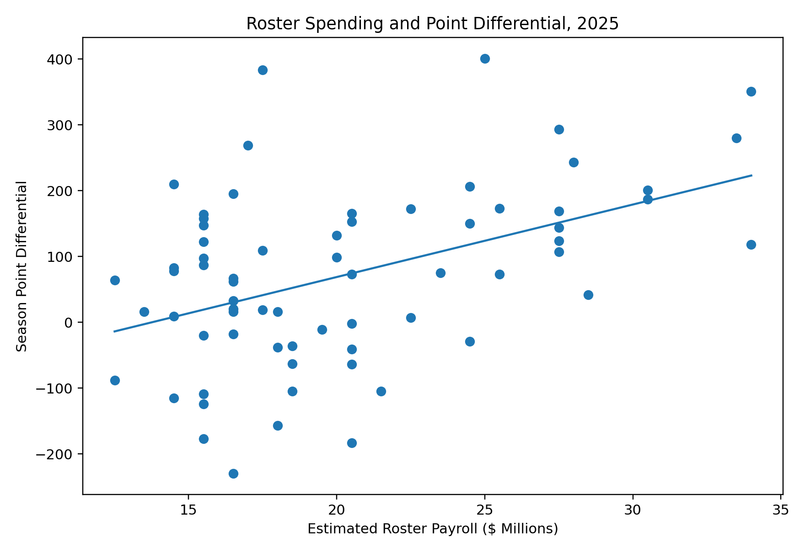

# Does College Football Roster Spending Predict Winning?

**Evidence from the 2025 college football regular season**

This project asks whether estimated roster spending predicts on-field success in college football. The dataset covers 68 major programs, with performance lined up to each team's 12-game 2025 regular season. OLS regressions were run in Stata with heteroskedasticity-robust standard errors.

## Research question

**Is higher estimated roster spending associated with better regular-season performance in college football?**

## Key findings

- In the 68-team baseline model, an additional **$1 million** in estimated roster payroll is associated with approximately **0.21 additional regular-season wins**.
- In a conference-controlled robustness specification restricted to the ACC, Big 12, Big Ten, and SEC, an additional **$1 million** is associated with approximately **0.32 additional wins**.
- In the same conference-controlled specification, an additional **$1 million** is associated with about **15.4 additional points of season point differential**.
- The payroll coefficient remains positive and statistically significant across low, midpoint, and high payroll estimates.
- The analysis identifies a strong association, but **does not establish a causal effect of spending on winning**.



## Data

The analysis dataset contains 68 programs and includes:

- estimated roster payroll range and midpoint
- conference
- regular-season wins and losses
- winning percentage
- points scored and allowed
- season point differential

Performance is restricted to the **12 scheduled regular-season games** for each team. Conference championship games, bowls, and College Football Playoff games are excluded so that every program is evaluated over a comparable outcome window.

Payroll estimates come from the Baratelli Institute's college football payroll estimates. Performance data were initially assembled from DraftEdge and audited against official school or conference sources when a game was omitted or a conference championship was included.

The workbook's **Audit** sheet documents every manual performance correction.

## Empirical strategy

The baseline model is:

**Winsᵢ = β₀ + β₁ Payrollᵢ + εᵢ**

I then estimate models with conference indicators:

**Winsᵢ = β₀ + β₁ Payrollᵢ + Conferenceᵢ + εᵢ**

All main models use heteroskedasticity-robust standard errors.

I also use season point differential as an alternative outcome and estimate log-payroll specifications to examine possible nonlinear relationships.

## Main results

| Specification | Outcome | Payroll coefficient | R² |
|---|---|---:|---:|
| Baseline, 68 teams | Wins | **0.206*** | 0.164 |
| Conference controls, 67 Power 4 teams | Wins | **0.315*** | 0.217 |
| Baseline, 68 teams | Point differential | **11.015*** | 0.202 |
| Conference controls, 67 Power 4 teams | Point differential | **15.358*** | 0.238 |

***p < 0.01. Robust standard errors.**

The preferred conference-controlled specification excludes the single Independent observation so that each conference category contains multiple schools and the robust joint F-test is well defined.



## Robustness checks

The analysis includes:

- heteroskedasticity-robust standard errors
- conference controls
- low and high payroll estimates in addition to the midpoint estimate
- log payroll specifications
- point differential as an alternative performance measure
- exclusion of the lone Independent observation in the preferred conference-controlled robustness specification

The positive payroll relationship remains across these alternative specifications.

## Limitations

This is an observational cross-sectional analysis, so the coefficients should **not** be interpreted causally. Estimated payroll may be correlated with other determinants of performance, including recruiting talent, coaching quality, historical program strength, schedule difficulty, facilities, and institutional resources.

The payroll figures are estimates rather than audited school payroll disclosures, which introduces measurement uncertainty. The analysis also covers only one season.

Future work could add recruiting talent, strength of schedule, prior-year performance, coaching changes, and multiple seasons of data.

## Repository structure

```text
college-football-roster-spending-2025/
├── README.md
├── data/
│   └── 2025_roster_spending_performance_data_CLEANED.xlsx
├── code/
│   └── nil_project_2025.do
├── figures/
│   ├── payroll_vs_wins.png
│   └── payroll_vs_point_diff.png
└── results/
    └── regression_results.md
```

## Reproducing the analysis

1. Clone or download this repository.
2. Open Stata.
3. Set the working directory to the repository root.
4. Run:

```stata
do "code/nil_project_2025.do"
```

The do-file imports the cleaned Excel dataset, reproduces the regressions, exports the two figures, and optionally saves a Stata `.dta` file.

## Data sources

- Payroll estimates: Baratelli Institute — College Football Payroll by School  
  https://baratelliinstitute.com/college-football-payroll-by-school
- Base performance table: DraftEdge — College Football Team Rankings  
  https://draftedge.com/cfb/cfb-team-rankings/
- Official school and conference sources used for audited corrections are listed in the workbook's **Audit** sheet.

## Author

Liam Williams

Economics / quantitative research portfolio project.
