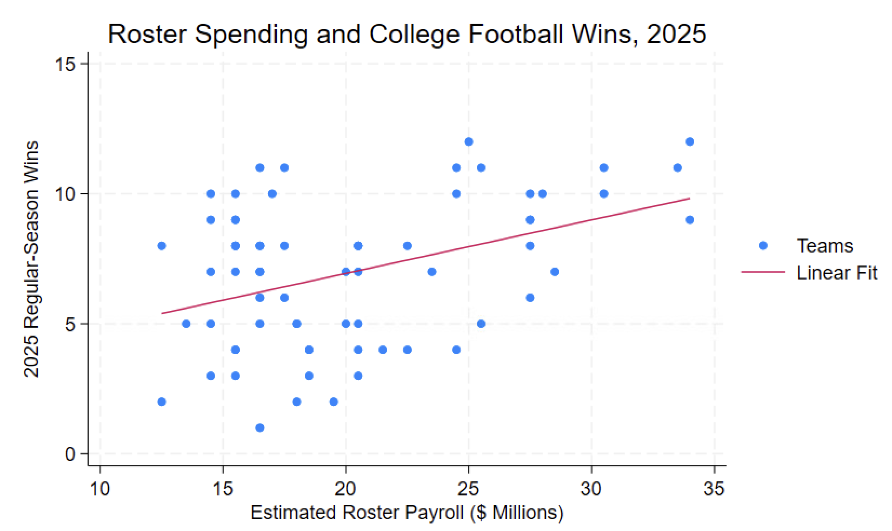
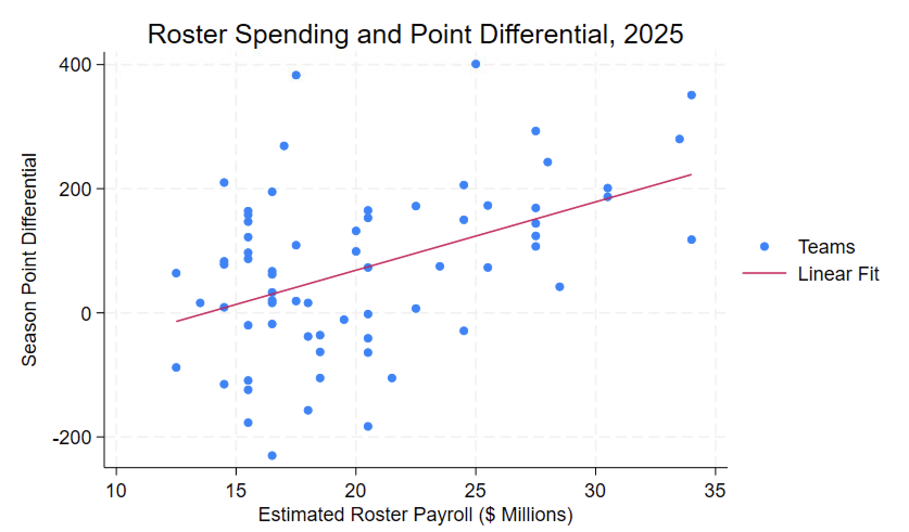

# Does College Football Roster Spending Predict Winning?

**Evidence from the 2025 College Football Regular Season**

College football has changed significantly in recent years with the growth of NIL and direct roster spending. Some programs are now spending millions of dollars more than others on their rosters, which raises the question of whether that extra spending is actually associated with better performance on the field.

This project looks at estimated roster payroll and regular-season performance for 68 major college football programs during the 2025 season. I use OLS regression models in Stata to test whether programs with higher estimated roster spending tend to win more games.

## Research Question

**Is higher estimated roster spending associated with better regular-season performance in college football?**

## Main Findings

The results show a positive relationship between estimated roster payroll and team performance.

- In the baseline model using all 68 teams, an additional **$1 million in estimated roster payroll is associated with about 0.21 additional regular-season wins**.
- When conference controls are added for the ACC, Big 12, Big Ten, and SEC, an additional **$1 million is associated with about 0.32 additional wins**.
- In the conference-controlled point differential model, an additional **$1 million in payroll is associated with about 15.4 additional points of season point differential**.
- The payroll coefficient remains positive and statistically significant when using the low, midpoint, and high payroll estimates.
- These results show an association between roster spending and performance, but they **do not prove that higher spending directly causes teams to win more games**.



## Data

The dataset contains 68 college football programs from the 2025 season. The main variables included are:

- estimated roster payroll range
- estimated payroll midpoint
- conference
- regular-season wins
- regular-season losses
- winning percentage
- points scored
- points allowed
- season point differential

Team performance is limited to each school's **12 scheduled regular-season games**. Conference championship games, bowl games, and College Football Playoff games are excluded.

I did this so that every team is being compared over the same number of scheduled games rather than allowing postseason success to give some programs additional opportunities for wins.

Roster payroll estimates come from the Baratelli Institute's college football payroll estimates. Performance data were initially collected using DraftEdge and then checked against official school and conference records when necessary.

Some teams had games missing from the original performance data or had conference championship games included. These observations were manually corrected. The **Audit** sheet in the Excel workbook documents these changes.

## Empirical Strategy

The main regression model used in this project is:

**Winsᵢ = β₀ + β₁ Payrollᵢ + εᵢ**

In this model, wins are the dependent variable and estimated roster payroll is the independent variable.

The coefficient β₁ represents the estimated change in regular-season wins associated with an additional $1 million in roster payroll.

I also estimate a model that controls for conference:

**Winsᵢ = β₀ + β₁ Payrollᵢ + Conferenceᵢ + εᵢ**

Conference controls are included because spending and competition can differ between conferences. Controlling for conference allows the model to compare teams while accounting for some of these differences.

All main regression models use heteroskedasticity-robust standard errors.

I also use point differential as another measure of team performance. Point differential may provide additional information beyond wins because it measures how much a team outscored or was outscored by its opponents throughout the season.

Log-payroll models are also estimated to test whether the relationship between payroll and performance may be nonlinear.

## Main Results

| Specification | Outcome | Payroll Coefficient | R² |
|---|---|---:|---:|
| Baseline, 68 teams | Wins | **0.206*** | 0.164 |
| Conference controls, 67 Power 4 teams | Wins | **0.315*** | 0.217 |
| Baseline, 68 teams | Point differential | **11.015*** | 0.202 |
| Conference controls, 67 Power 4 teams | Point differential | **15.358*** | 0.238 |

***p < 0.01. Robust standard errors.**

The baseline wins regression shows that an additional $1 million in estimated roster payroll is associated with approximately 0.206 additional regular-season wins.

This means that a program spending $5 million more than another program would be associated with roughly one additional regular-season win under the baseline model.

The coefficient becomes larger after conference controls are added. In that model, an additional $1 million in payroll is associated with approximately 0.315 additional wins.

The point differential regressions show a similar pattern. Higher-spending teams also tend to have larger season point differentials.

The preferred conference-controlled model contains 67 teams because the single Independent program was excluded. With only one Independent observation, it does not provide a meaningful conference comparison.



## Robustness Checks

Several additional models were estimated to test whether the main relationship remained under different specifications.

These checks include:

- heteroskedasticity-robust standard errors
- conference controls
- low payroll estimates
- midpoint payroll estimates
- high payroll estimates
- log payroll specifications
- point differential as an alternative measure of performance
- exclusion of the lone Independent observation from the main conference-controlled model

Across these different specifications, estimated roster payroll continues to have a positive relationship with team performance.

## Limitations

There are several important limitations to this analysis.

The largest limitation is that the data are observational. Because of this, the regression results cannot show that spending more money directly causes a college football team to win more games.

Programs with larger payrolls may also have other advantages that contribute to winning. These could include recruiting talent, coaching quality, historical program strength, facilities, schedule difficulty, fan support, and other institutional resources.

Another limitation is that the roster payroll numbers are estimates rather than audited financial disclosures from each university. Because of this, there is likely some measurement error in the payroll variable.

The project also only examines the 2025 season. One season provides a useful comparison between programs, but multiple seasons would provide a much larger dataset and allow the relationship between spending and performance to be studied over time.

Future versions of this project could include variables such as:

- recruiting rankings
- strength of schedule
- prior-year performance
- coaching changes
- returning production
- transfer portal activity
- multiple seasons of payroll and performance data

These variables could help isolate the relationship between roster spending and winning more clearly.

## Repository Structure

```text
college-football-roster-spending-2025/
├── README.md
├── data/
│   └── 2025_roster_spending_performance_data_CLEANED.xlsx
├── code/
│   └── nil_project_2025.do
├── figures/
│   ├── payroll_vs_wins.png
│   └── payroll_vs_point_diff.png
└── results/
    └── regression_results.md
```

## Reproducing the Analysis

To reproduce the analysis:

1. Clone or download this repository.
2. Open Stata.
3. Set the working directory to the repository root.
4. Run:

```stata
do "code/nil_project_2025.do"
```

The do-file imports the cleaned Excel dataset, runs the regressions used in the project, and creates the figures shown in this README.

It can also optionally save the cleaned dataset as a Stata `.dta` file.

## Data Sources

**Roster Payroll Estimates**

Baratelli Institute — College Football Payroll by School  
https://baratelliinstitute.com/college-football-payroll-by-school

**Team Performance Data**

DraftEdge — College Football Team Rankings  
https://draftedge.com/cfb/cfb-team-rankings/

Official school and conference sources were also used to verify and correct individual team records when necessary. These corrections are documented in the **Audit** sheet of the Excel workbook.

## Author

**Liam Williams**  
Oregon State University

Economics and quantitative research portfolio project.
